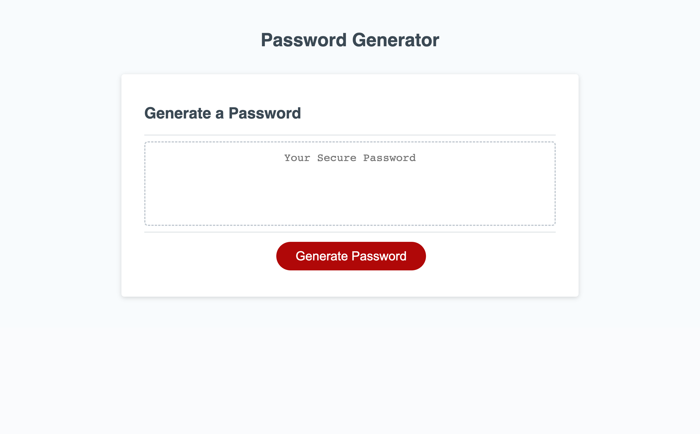

# password-generator

## Description
The purpose of this project was to modify starter code to create an application that 
enables emmployees to generate a random safe password based on the criteria a user selects. 
## Links

<a href="https://saeeda14.github.io/password-generator/"> Link to Deployed website </a>

<a href="https://github.com/Saeeda14/password-generator.git"> Link to Repo code </a>

## Screenshot

